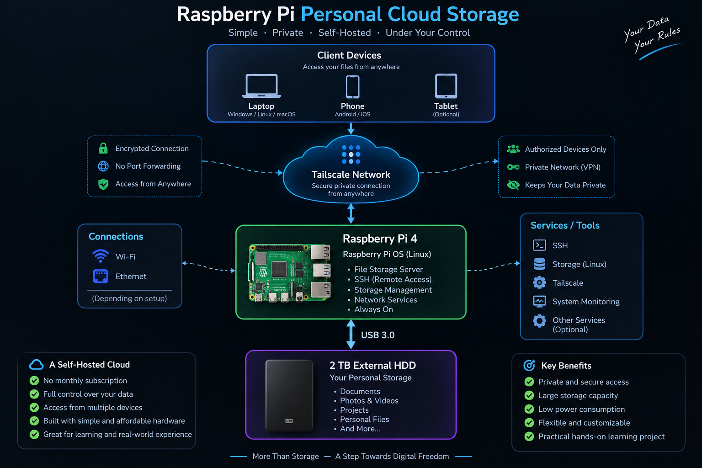

# Raspberry Pi Personal Cloud Storage

> A self-hosted personal cloud storage system built with Raspberry Pi, external HDD storage, Linux, and Tailscale for private remote access.

<p align="center">
  
</p>

---

## 📌 Overview

This project is a personal cloud storage system built around a Raspberry Pi 4 and a 2 TB external hard drive. The Raspberry Pi acts as the central server, while the external HDD provides the primary storage capacity for personal files, documents, media, and other data.

The system was built as a practical exploration of self-hosted infrastructure. Instead of depending entirely on a third-party cloud provider, the project uses affordable hardware and open technologies to create a storage environment that can be managed directly. The work involved Raspberry Pi OS, Linux storage management, external HDD integration, networking, remote administration, and private remote connectivity through Tailscale.

---

## 🎯 Project Goals

The main goal was to build a practical, low-cost personal storage system while gaining hands-on experience with server infrastructure.

The project focused on:

- Building a personal file storage server
- Using Raspberry Pi as a lightweight server
- Connecting and managing external storage
- Accessing the server from multiple devices
- Enabling remote administration
- Learning Linux server and storage management
- Understanding private networking
- Exploring self-hosted infrastructure
- Keeping control of personal data and hardware

---

## 🏗️ System Architecture

```text
                         ┌───────────────────┐
                         │   Client Devices  │
                         │                   │
                         │ Laptop / Phone    │
                         └─────────┬─────────┘
                                   │
                                   │
                            Tailscale Network
                                   │
                                   ▼
                         ┌───────────────────┐
                         │   Raspberry Pi 4  │
                         │                   │
                         │ Raspberry Pi OS   │
                         │ Linux Services    │
                         │ SSH               │
                         └─────────┬─────────┘
                                   │
                                USB 3.0
                                   │
                                   ▼
                         ┌───────────────────┐
                         │      2 TB HDD     │
                         │                   │
                         │ Personal Files    │
                         │ Documents         │
                         │ Media             │
                         └───────────────────┘